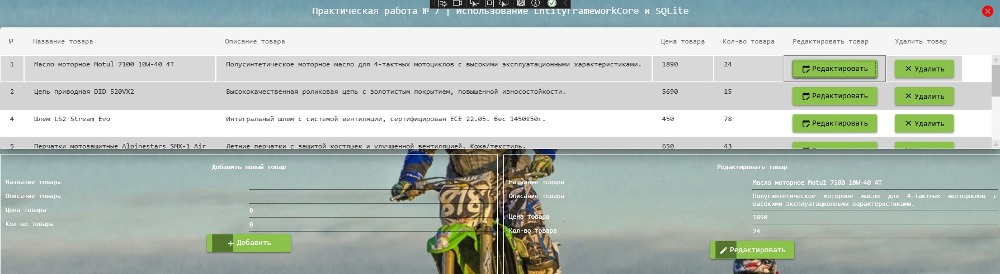

<h1>Задание 7.Использование EntityFrameworkCore и SQLite</h1>

Проект представляет собой простое WPF-приложение для управления каталогом товаров с использованием Entity Framework Core и SQLite

Для запуска необходимо открыть "Task7SQLite.exe"

